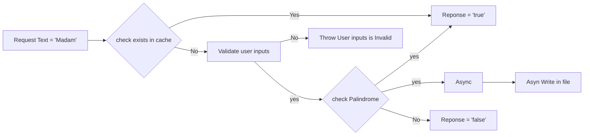

# Palindrome Checker Assignment

Assignment on Palindrome using Sprint boot

### Requirement

Develop a REST API to accept a username and text value and return an indicator whether
that value is a palindrome - A palindrome is a word, number, phrase, or other sequence of
characters which reads the same backward as forward, such as madam or kayak. The solution
should include the ability to:

*  Validate the input – for the first release values with spaces or numbers should be
   rejected. The solution should support the ability to easily add further validations over
   time though.
*  To improve performance a cache should be kept of previously processed values.
*  Each processed value should also be written to a permanent storage solution (for the
   purposes of this POC a file system can be used however this should be easily
   substituted for a Database solution for example).
*  Upon startup the cache should be populated with the contents from the permanent
   storage.
*  For performance reasons the API response should not be dependent/blocked by the
   completion of the permanent persistence.
*  This solution should include appropriate tests
*  Diagnose any support enquires.

### Deliverables

A copy of the source code can be clone from the below github repository,

### [https://github.com/harivarma-anbumani/palindromechecker.git](https://github.com/harivarma-anbumani/palindromechecker.git)

#### Instructions on how to build/execute it:

###### Build the code: gradlew clean build

###### Execue the code: java -jar build\libs\palindromechecker-0.0.1-SNAPSHOT.jar

| Number# | Technology Used         | 
|---------|-------------------------|
| 1       | 	Java 22                |
| 2       | 	Gradle v8                |
| 3       | 	Spring boot            |
| 4       | 	Spring REST            |
| 5       | 	lombok                 |
| 6       | 	Embedded Tomcat        |

**Working Logic:**

**Sample Output:**

| Number# | Input            | Output                                               | 
|---------|------------------|------------------------------------------------------|
| 1       | 	"Madam"         | $${\color{green}True}$$                              | 
| 2       | 	"KaYak"         | $${\color{green}True}$$                              |
| 3       | 	"Ma121am"       | $${\color{green}True}$$                              | 
| 4       | 	"A123454321A"   | $${\color{green}True}$$                              |
| 5       | 	"test Text"     | $${\color{red}False}$$                               |
| 6       | 	"testText12345" | $${\color{red}False}$$                               |
| 7       | 	"1234Test"      | $${\color{Orange}Invalid Input}$$                    |
| 8       | 	" testText"     | $${\color{Orange}Invalid Input}$$ Starts with Space  |

**Sample Curl Output:**

1. curl -X POST "http://localhost:8080/api/checkPalindrome" -H "accept: application/json" -H "Content-Type: application/json" -d { "username" : "testuser1", "text": "MadAM" }

   Output: { "username": "testuser1", "text": "MadAM", "palindrome": true }

2. curl -X POST "http://localhost:8080/api/checkPalindrome" -H "accept: application/json" -H "Content-Type: application/json" -d { "username" : "testuser1", "text": "KaYak" }

   Output: { "username": "testuser1", "text": "KaYak", "palindrome": true }

3. curl -X POST "http://localhost:8080/api/checkPalindrome" -H "accept: application/json" -H "Content-Type: application/json" -d { "username" : "testuser1", "text": "KaYak123" }

   Output: { "username": "testuser1", "text": "KaYak123", "palindrome": false }

4. curl -X POST "http://localhost:8080/api/checkPalindrome" -H "accept: application/json" -H "Content-Type: application/json" -d { "username" : "testuser1", "text": "123KaYak" }

   Output:
   * Bad Request(400)
   * "Invalid User Request: Only Non-Empty and alphanumeric characters are allowed as inputs"
